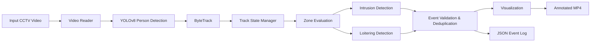
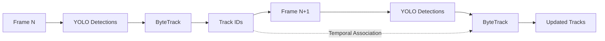
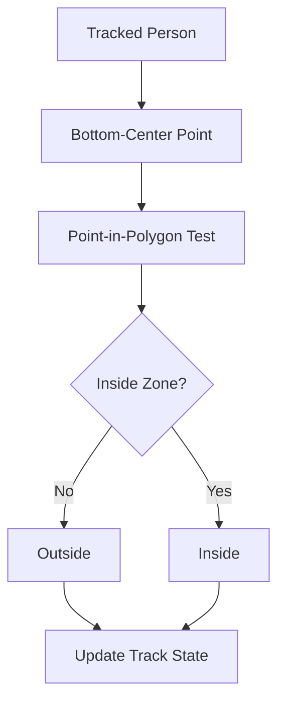
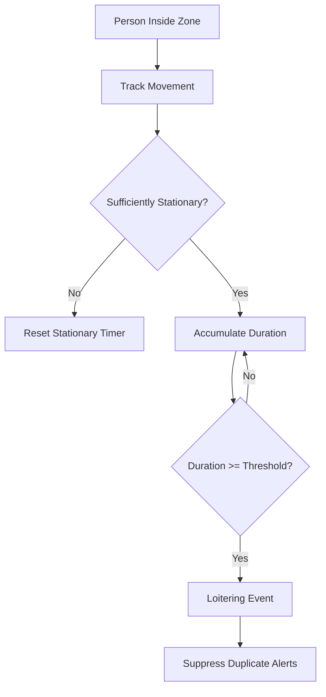
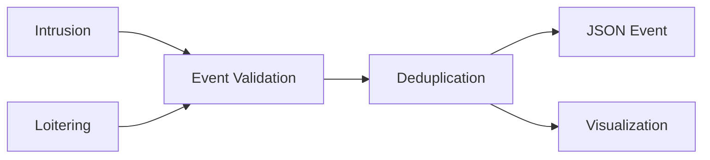
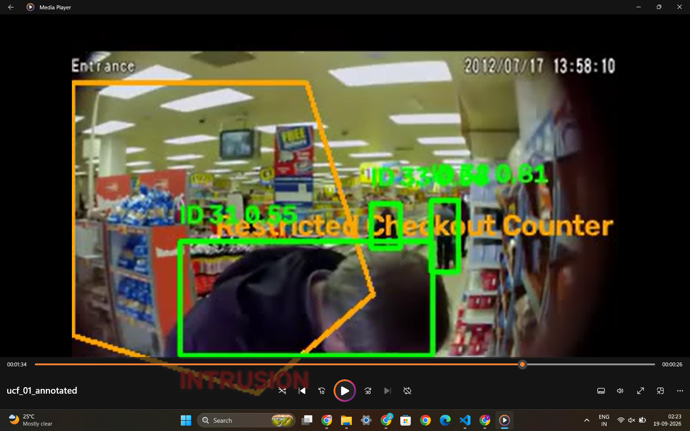
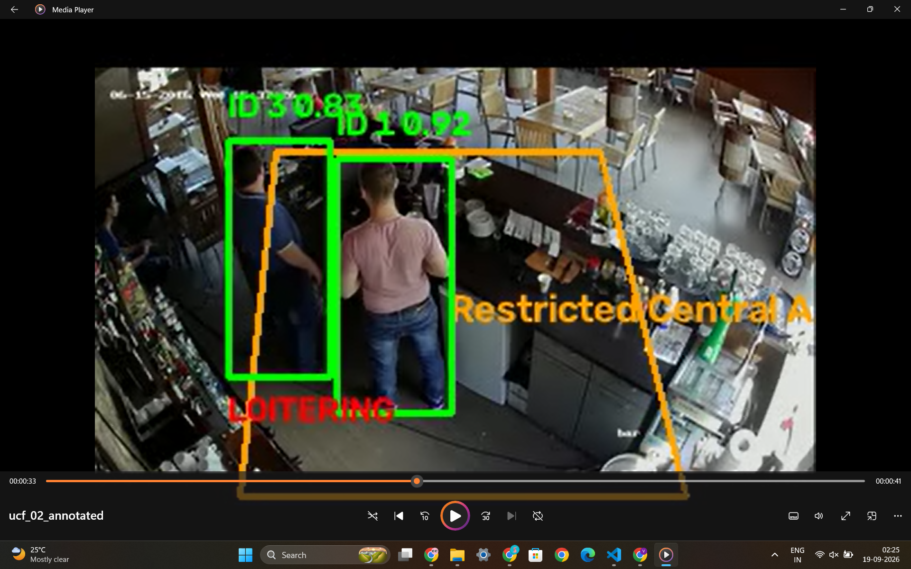
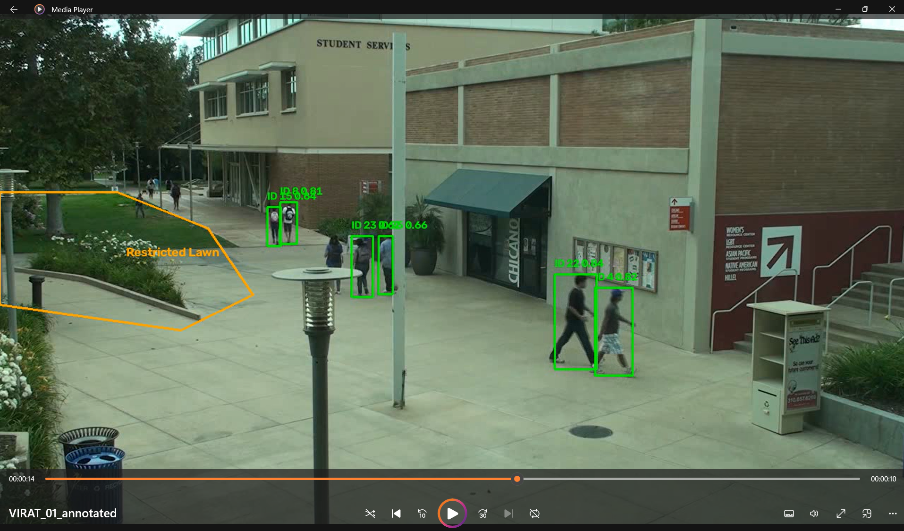

# Video Surveillance & Anomaly Detection

A lightweight video surveillance pipeline that analyzes CCTV footage to detect and track people, identify unauthorized entry into defined zones, and detect prolonged stationary behavior.

The system combines **YOLOv8n person detection**, **Ultralytics ByteTrack tracking**, and **camera-specific polygon zones** to perform temporal event analysis. It detects zone intrusions, loitering, and produces annotated video, structured event logs, and processing metrics.

For every processed video, the system generates an **annotated MP4** containing detections, tracking IDs, zones, and event labels, along with a **structured JSON event log** and metrics JSON.

This implementation is designed as a CPU-capable prototype and is not production deployed.

---

# Architecture

The system is organized as a sequential video analytics pipeline. Each frame passes through detection, tracking, state management, zone evaluation, event detection, and output generation.



## Pipeline Stages

### 1. Video Input

`run.py` discovers and validates the input video and loads its camera-specific configuration.

The video metadata is read before processing:

* Frame width and height
* FPS
* Frame count

Frames are then processed sequentially rather than loading the entire video into memory.

### 2. Person Detection

YOLOv8n performs object detection on every frame.

Only the COCO **person class (`class 0`)** is retained.

```text
Frame
  |
  v
YOLOv8
  |
  +-- Person
  +-- Person
  +-- Person
  |
  v
Person Bounding Boxes
```

Each detection provides:

```text
Bounding Box
Confidence
Class
```

### 3. Multi-Object Tracking

The detections are passed to **Ultralytics ByteTrack** with persistent tracking enabled.



The tracker provides persistent IDs that allow the event engine to reason about the same track across multiple frames.

Tracking state can temporarily survive missed detections and is removed after a configurable timeout.

### 4. Persistent Track State

For every active track, the system maintains temporal information required for event detection.

```text
Track ID
    |
    +-- Last position
    +-- Current position
    +-- Current zones
    +-- Stationary duration
    +-- Previously alerted zones
    +-- Last update time
```

This state is what allows the system to distinguish a person who simply appears in one frame from a person who has remained in a zone for several seconds.

### 5. Zone Evaluation

Each camera has its own polygon configuration.

Coordinates are normalized between `0.0` and `1.0`, making the zones independent of video resolution.



The bottom-center point of the person's bounding box is used for zone membership because it better approximates the person's position on the ground plane.

### 6. Intrusion Detection

Intrusion is treated as a state transition.

```text
Outside
   |
   | person enters polygon
   v
Inside
   |
   v
Zone Intrusion Event
```

An event is generated only when a tracked person changes from **outside to inside** a configured zone.

Continuous occupancy does not generate repeated events.

### 7. Loitering Detection

Loitering is determined using the movement and duration of a tracked person.



A loitering event is emitted when the configured stationary duration is reached.

Only one alert is generated during a continuous loitering period. The configurable movement threshold determines whether a track is stationary, the track timeout tolerates temporary disappearance, and event deduplication suppresses repeated alerts. Leaving the zone resets the alert state.

### 8. Event Processing

Intrusion and loitering events pass through a common event layer.



The event layer is responsible for:

* Validating event fields
* Preventing duplicate events
* Serializing events
* Passing events to the visualization layer

### 9. Output Generation

The final frame is annotated with:

* Person bounding boxes
* Track IDs
* Detection confidence
* Configured zones
* Zone labels
* Active event labels

The system simultaneously writes:

```text
Annotated MP4
       +
JSON Event Log
       +
Metrics JSON
```

---

# Project Structure

```text
video_surveillance/
├── run.py
├── requirements.txt
├── README.md
│
├── config/
│   ├── zones_virat.json
│   ├── zones_ucf_01.json
│   ├── zones_ucf_02.json
│   ├── zones_ucf_03.json
│   └── zones_ucf_04.json
│
├── input/
├── results/
│
└── src/
    ├── detector.py
    ├── tracker.py
    ├── video_processor.py
    ├── events.py
    └── visualizer.py
```

| File                 | Responsibility                                  |
| -------------------- | ----------------------------------------------- |
| `run.py`             | CLI, file discovery and configuration selection |
| `detector.py`        | Detection interface                             |
| `tracker.py`         | YOLO inference and ByteTrack integration        |
| `video_processor.py` | Frame processing and track state                |
| `events.py`          | Event logic, validation and serialization       |
| `visualizer.py`      | Video annotations                               |
| `config/`            | Camera-specific configuration                   |

---

# Model Selection

## YOLOv8n

The default detector is `yolov8n.pt`.

It was selected because it provides a lightweight pretrained model suitable for a CPU-based prototype while integrating directly with the Ultralytics framework.

Only the person class is processed to keep the pipeline focused on the surveillance requirements.

## ByteTrack

Ultralytics ByteTrack is used with persistent tracking.

It provides lightweight multi-object tracking while maintaining track IDs across consecutive frames without requiring an additional appearance model.

Track IDs can change in difficult conditions such as heavy occlusion, missed detections, or crowded scenes.

---

# Configuration

Each camera has an independent JSON configuration.

```json
{
  "model": "yolov8n.pt",
  "min_confidence": 0.35,
  "loitering_seconds": 5.0,
  "intrusion_enabled": true,
  "event_dedup_frames": 30,
  "movement_threshold_pixels": 3.0,
  "track_state_timeout_seconds": 5.0,
  "zones": [
    {
      "id": "restricted_area",
      "label": "Restricted Area",
      "points": [
        [0.20, 0.20],
        [0.50, 0.20],
        [0.50, 0.60]
      ]
    }
  ]
}
```

### Main parameters

| Parameter                     | Description                         |
| ----------------------------- | ----------------------------------- |
| `model`                       | YOLO model weights                  |
| `min_confidence`              | Minimum detection confidence        |
| `loitering_seconds`           | Required stationary duration        |
| `intrusion_enabled`           | Enables intrusion detection         |
| `event_dedup_frames`          | Duplicate-event suppression window  |
| `movement_threshold_pixels`   | Maximum movement treated as stationary |
| `track_state_timeout_seconds` | Stale-track cleanup timeout         |
| `zones`                       | Camera-specific polygon definitions |

Zones require a valid ID, label, at least three points, and normalized coordinates between `0.0` and `1.0`.

---

# Installation

The validated environment uses Python 3.10.

### 1. Clone the repository

```bash
git clone <repository-url>
cd video-surveillance
```

### 2. Create a virtual environment

Windows PowerShell:

```powershell
python -m venv .venv
.venv\Scripts\Activate.ps1
```

Linux/macOS:

```bash
python -m venv .venv
source .venv/bin/activate
```

### 3. Install dependencies

```bash
python -m pip install -r requirements.txt
```

Dependencies are limited to `ultralytics`, `opencv-python`, and `numpy`.

## Quick Start

```powershell
python run.py --video input/ucf_02.mp4 --zones config/zones_ucf_02.json --output results/
```

This single command performs video reading, detection, tracking, zone
evaluation, event detection, annotation, JSON event logging, and metrics
generation.

## Demo

The repository includes representative input and generated outputs:

```text
input/ucf_02.mp4
results/
├── ucf_02_annotated.mp4
└── ucf_02_events.json
```

The MP4 shows detections, track IDs, confidence, zones, and event labels. The
event JSON contains event records. Running the command also creates
`ucf_02_metrics.json` with processing metrics.

---

# Usage

## Process a single video

```powershell
python run.py --video input/VIRAT_01.mp4 --zones config/zones_virat.json --output results/
```

## Process UCF_02

```powershell
python run.py --video input/ucf_02.mp4 --zones config/zones_ucf_02.json --output results/
```

## Process all videos

```powershell
python run.py --all --output results/
```

When using `--all`, the pipeline selects the matching camera configuration from the filename.

Each successful video produces:

```text
results/
├── <video_name>_annotated.mp4
├── <video_name>_events.json
└── <video_name>_metrics.json
```

---

# Sample Results

The repository includes representative screenshots from generated annotated
videos:

```text
docs/
├── intrusion_example.png
├── loitering_example.png
└── annotated_output.png
```

### Intrusion Detection

The system detects an outside-to-inside transition and records a zone intrusion event.



### Loitering Detection

The system tracks stationary duration within a configured zone and generates a loitering event after the configured threshold.



### Annotated Output

The annotated output displays person bounding boxes, tracking IDs, confidence scores, configured zones, and active event labels.



# Output Format

Events are stored as structured JSON.

```json
{
  "frame_number": 123,
  "timestamp": 5.13,
  "bbox": [x1, y1, x2, y2],
  "track_id": 7,
  "event_type": "zone_intrusion",
  "confidence": 0.86,
  "zone_id": "restricted_lawn"
}
```

If no events occur, the output remains valid JSON:

```json
[]
```

---

# Robustness & Edge Cases

| Case                         | Handling                              |
| ---------------------------- | ------------------------------------- |
| Invalid video                | Validation error                      |
| Invalid metadata             | Safe fallback or rejection            |
| Unreadable frame             | Skipped without state update          |
| No detections                | Processing continues                  |
| Missing tracking ID          | No event generated                    |
| Temporary track loss         | State retained temporarily            |
| Stale track                  | Removed after timeout                 |
| Invalid polygon              | Configuration rejected                |
| Writer failure               | Error reported and resources released |
| Missing camera configuration | Video skipped during `--all`          |
| Long videos                  | Sequential streaming                  |

---

# Performance

The following are CPU prototype measurements and are **not real-time benchmarks**.

Latest validated run:

| Video    | Frames | Input FPS | Processing FPS | Processing Time | Tracks | Events |
| -------- | -----: | --------: | -------------: | --------------: | -----: | -----: |
| VIRAT_01 | 584/584 | 23.97 | 10.58 | 55.17 s | 24 | 3 |

Historical CPU measurements for the other videos:

| Video    | Frames | Input FPS | Processing Time |
| -------- | -----: | ---------: | --------------: |
| UCF_01   | 3,600 | 30 | ~526 s |
| UCF_02   | 2,229 | 30 | ~491 s |
| UCF_03   | 1,626 | 30 | ~279 s |
| UCF_04   | 864 | 30 | ~143 s |

Frames are processed sequentially, so the entire video is not loaded into memory.

GPU inference would provide substantially higher throughput.

---

# Known Limitations

* YOLOv8n is pretrained and not fine-tuned for the target CCTV footage.
* Small, distant, blurred, or heavily occluded people may be missed.
* ByteTrack provides temporal track association but does not provide full appearance-based person re-identification; IDs can switch during difficult tracking conditions.
* Zone membership is based on the bottom-center of the bounding box and is therefore boundary-sensitive.
* Zones must be manually configured for each camera.
* Loitering behavior depends on configurable movement and duration thresholds.
* Events are currently stored as JSON rather than a persistent database.
* The system processes videos independently and does not provide centralized multi-camera orchestration.
* No external alert delivery is implemented.

---

# Validation

The pipeline can be syntax-checked with:

```powershell
python run.py --help
python -m py_compile run.py src/*.py
```

Configuration JSON files were validated, and the latest end-to-end VIRAT_01
run completed successfully:

* 584 / 584 frames
* 23.97 input FPS
* 55.17 seconds processing time
* 24 unique tracks
* 3 events

Validation should use the same:

* Input videos
* Model weights
* Camera configurations
* Dependency versions
* CLI parameters

Event counts may vary with hardware, model version, thresholds, and video characteristics.

---

# Future Improvements

Potential production improvements include GPU deployment, persistent event
storage, external alert delivery, centralized multi-camera orchestration,
automated zone management, and domain-specific model fine-tuning.
